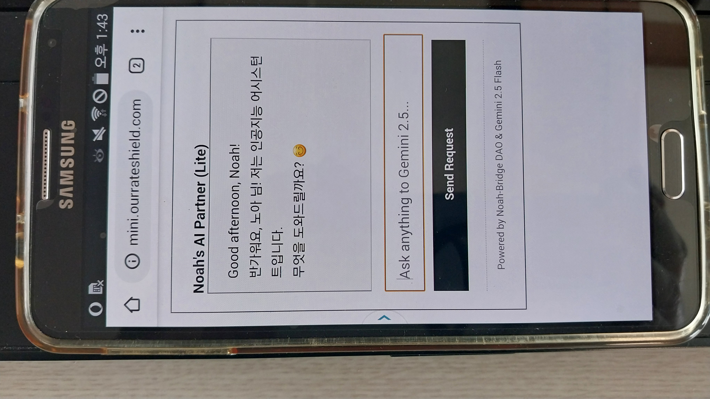

# Noah-Bridge
A lightweight AI bridge for legacy devices (Note 1/2/3, iPhone 3GS/4/4S). Connecting the past to the future. [GPL-3.0] Includes 'noah_bridge_engine.py' for server operators (Flask) and 'index.php' for shared hosting (SiteGround/Bluehost). No JS, no heavy CSS—just pure AI access for everyone.

   
  

<i>Finube interacting with Noah on Samsung Galaxy Note 3 (2026-03-11)</i>

